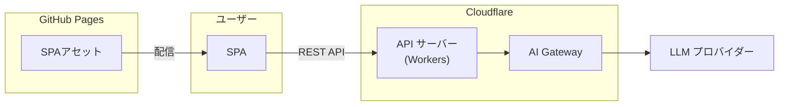

# Poke API スタジアム

> PokeAPI を利用したミニゲーム集アプリ

## プロジェクト概要

[PokeAPI](https://pokeapi.co/) で取得したポケモンのデータを使ったミニゲーム集を提供する。

---

## アーキテクチャ



**技術スタック**:

- **フロントエンド**: Skeleton v4 (Svelte v5 + TailwindCSS v4 + Vite v6)
- **バックエンド**: Python 3.13 + FastAPI
- **インフラ**: GitHub Pages（フロントエンド） / Cloudflare Workers（バックエンド）

---

## ディレクトリ構成

```
poke-api-stadium/
├── apps/
│   ├── skeleton-app/      # フロントエンド (Skeleton)
│   └── fast-api-server/   # バックエンド (FastAPI)
└── docs/                  # ドキュメント
```

---

## ローカル起動

```bash
docker compose up
```

---

## デプロイ

**フロントエンド**（GitHub Pages）:

```bash
cd apps/skeleton-app
npm run deploy
```

**バックエンド**（Cloudflare Workers）:

```bash
cd apps/fast-api-server
uv run poe deploy
```

**公開 URL**: https://okmethod.github.io/poke-api-stadium/

---

**メンテナー**: @okmethod
