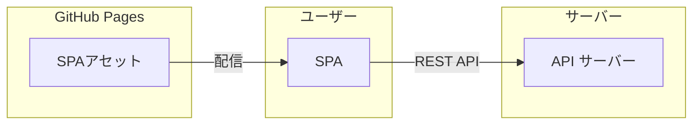

# my-static-site

> フロントエンド SPA + バックエンド API サーバーのテンプレート

## プロジェクト概要

GitHub Pages へのデプロイを前提とした、Svelte × FastAPI の開発テンプレート。

---

## アーキテクチャ



**技術スタック**:

- **フロントエンド**: Skeleton v4 (Svelte v5 + TailwindCSS v4 + Vite v6)
- **バックエンド**: Python 3.13 + FastAPI
- **インフラ**: Docker Compose でワンコマンド起動

TODO: バックエンドのホストとデプロイ検討

---

## ディレクトリ構成

```
my-static-site/
├── apps/
│   ├── skeleton-app/      # フロントエンド (Skeleton)
│   └── fast-api-server/   # バックエンド (FastAPI)
└── docs/                  # ドキュメント
```

---

## ローカル起動

```bash
docker compose up
```

---

## デプロイ

GitHub Pages への静的デプロイ:

```bash
cd apps/skeleton-app
npm run deploy
```

**公開 URL**: https://okmethod.github.io/my-static-site/

---

**メンテナー**: @okmethod
