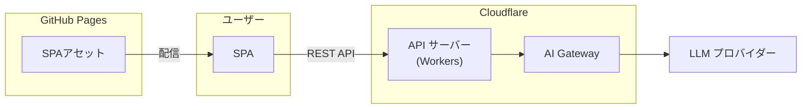

# ドキュメント目次

このディレクトリには、プロジェクトの**ストック情報**（永続的な知識）が整理されています。

---

## プロジェクトコンセプト

### 課題と目的

**課題**:

- PokeAPI の豊富なデータソースを活用したミニゲームを、保守しやすい設計で実装したい

**目的**:

- PokeAPI を活用したミニゲームを楽しめる SPA を提供する
- Port/Adapter パターンによる疎結合設計で、将来の機能追加・変更に強い構造を維持する

### コンセプト

[PokeAPI](https://pokeapi.co/) を入口にした、ポケモンデータ活用型ミニゲーム集

- PokeAPI からポケモンデータを取得し、様々なミニゲームに活用する SPA を提供
- Hono サーバーをマルチプロバイダー対応の LLM エンドポイントプロキシとして利用し、ユーザーはパスフレーズのみで利用可能

---

## スコープ方針

### やること (In Scope)

- PokeAPI を利用したポケモンデータの取得・表示
- ミニゲーム集（じゃんけん、だれだ、くらべ、しりとり）
- 世代フィルタによるポケモン範囲の絞り込み
- Port/Adapter パターンによる外部 API 依存の抽象化

### やらないこと (Out of Scope)

- PokeAPI のプロキシ（PokeAPI は API キー不要のため）
- Matter.js 物理演算ゲーム（後フェーズで設計を改めて検討）
- バックエンドを経由したデータ永続化（スコア保存等）

---

## ドキュメント構成

```
# ストック情報（永続的な情報）
docs/
├── domain/        # ドメイン知識: ビジネスルールと実装のマッピング
├── architecture/  # アーキテクチャ: 技術的な構成・方針
└── adr/           # ADR: 設計判断の記録
```

### ドキュメント更新が必要になるタイミング

| ドキュメント      | 更新タイミング                                 |
| ----------------- | ---------------------------------------------- |
| **domain/**       | 新しいドメインルールを検討する時 or 実装した時 |
| **architecture/** | アーキテクチャを大きく変更した時               |
| **adr/**          | 重要な技術的決定をした時                       |

## アーキテクチャ



---

## 技術スタック

### フロントエンド

- **開発環境**: Node.js 24
  - パッケージ管理: npm
  - Linter & Formatter: ESLint + Prettier
  - Type checker: tsc
  - Test: Vitest
  - Task Runner: npm scripts
- **言語**: TypeScript v6
- **フレームワーク**: SvelteKit v2 (Svelte v5)
- **UI ライブラリ**: Skeleton v4
- **スタイル**: TailwindCSS v4
- **バリデーション**: Zod v4
- **ビルド**: Vite v6
- **デプロイ・ホスティング**: gh-pages v6 + GitHub Pages

### バックエンド

- **開発環境**: Node.js 24
  - パッケージ管理: npm
  - Linter & Formatter: ESLint + Prettier
  - Type checker: tsc
  - Test: Vitest
  - Task Runner: npm scripts
- **言語**: TypeScript v6
- **Web フレームワーク**: Hono v4
- **バリデーション**: Zod v4
- **ビルド・ホスティング**: Wrangler v4 + Cloudflare Workers

---

## 関連リソース

- **[README.md](../README.md)**: ユーザー向けプロジェクト説明
- **[CLAUDE.md](../CLAUDE.md)**: Claude Code への指示書
