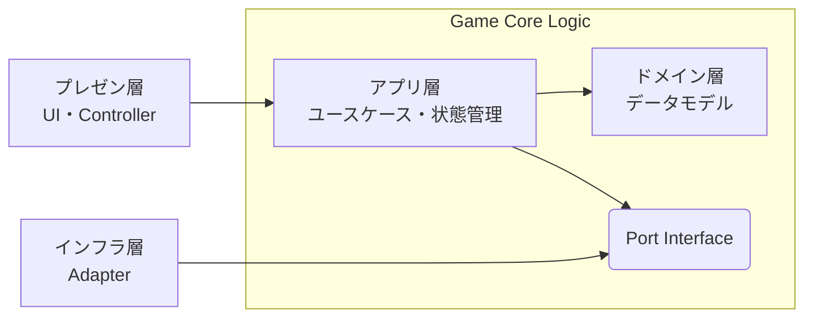

# アーキテクチャ概要

## コンセプト: 4 層構造 かつドメイン中心の Clean Architecture

外部サービス（PokeAPI・物理エンジン・LLM）への依存を UI・ゲームロジックから完全に分離し、変更に強くテストしやすい構成にする。

1. **Domain Layer（ドメイン層）** : 外部に依存しないポケモンデータモデル
2. **Application Layer（アプリ層）** : ユースケース・動的ゲーム状態管理・Port 定義
3. **Infrastructure Layer（インフラ層）** : 外部サービスアクセス Adapter
4. **Presentation Layer（プレゼン層）** : UI・Controller



**ディレクトリ構造**

```
skeleton-app/src/lib/
├── domain/          # ドメイン層
├── application/     # アプリ層
├── infrastructure/  # インフラ層
└── presentation/    # プレゼン層
```

---

## レイヤー構成

### Domain Layer

**責任**:

- PokeAPI から取得したポケモンデータの概念モデルを定義する
- 外部に依存しない静的データモデルと変換ロジック

**ディレクトリ構造**

```
src/lib/domain/
└── models/
```

**重要**:

- 何にも依存しない（Pure TypeScript）
- ここには Svelte や DOM のコードを一切書かない
- ロジック単体でのテストが可能

**主要コンポーネント**:

- **PokeData**: アプリ内部のポケモン統合モデル
  - PokeAPI の複数エンドポイント（`/pokemon`, `/pokemon-species`）を統合した表現
  - タイプ・ステータス・世代などのデータを統合管理する
  - PokeAPI レスポンス型（外部）とは明確に区別する

- **2dPhysics**: 2D物理演算モデル
  - 2D空間、物体の表現

### Application Layer

**責任**:

- 各ゲームの操作・状態管理をユースケースとして実装する
- Port Interface を定義し、インフラ層への依存を抽象化する

**ディレクトリ構造**

```
src/lib/application/
├── ports/
│   └── IXXXRepository  # 外部サービスに依存しないインターフェース
├── usecases/
│   └── GameXXX         # あるゲーム XXX のロジック
│       ├── facade.ts   # ゲーム操作の唯一の入り口
│       ├── store.ts    # ゲーム状態管理ストア
│       └── index.ts    # facade / store の再エクスポート
└── stores/             # アプリ全体の SSOT となる状態管理
```

**主要コンポーネント**:

- **IXXXRepository**: 外部サービスアクセスの抽象 Port Interface（Port/Adapter Pattern）
  - アプリ層は具象 API クライアントに依存しない

- **usecases**: ゲームロジックを純粋関数として実装
  - ドメインモデル（TypeData 等）を参照するが、UI には依存しない
  - プレゼン層に Facade 経由でのユーザ操作と、 store 経由での表示用データを提供する
  - store 内の状態を更新するのは Facade のみ
  - テスト時に UI なしで検証できる構造を維持する

### Infrastructure Layer

**責任**:

- 外部サービスとの通信を担う
- Port Interface を実装し、アプリ層を API の実装詳細から隔離する

**ディレクトリ構造**

```
src/lib/infrastructure/
├── adapters/  # 外部サービスアクセスの具象実装
└── api/       # 外部APIアクセスの Zod スキーマ検証
```

**主要コンポーネント**:

- **XXXAdapter**: 外部サービスアクセスの具象 Adapter（Port/Adapter Pattern）
  - PokeAPI を呼び出し、Zod でレスポンスを検証する
  - ドメインモデルへの変換を担う
  - テスト時はモック実装に差し替え可能

**依存性逆転（Port/Adapter Pattern）**:

- アプリ層は抽象 Port（例: `IPokeRepository`）に依存
- インフラ層が具象 Adapter（例: `PokeApiAdapter`）を提供
- → アプリ層は PokeAPI の実装詳細から完全に分離

### Presentation Layer

**責任**:

- Store の状態を画面に描画する
- ユーザー入力を受け取り、ユースケースを呼び出す
- UI 状態管理（テーマ、音声等）

**ディレクトリ構造**

```
src/lib/presentation/
├── components/   # UI コンポーネント
├── stores/       # UI 状態管理
└── sounds/       # 音声処理
```

**ロジックの責務**:

- Store の状態を画面に描画し、ユーザー入力を facade に伝える
- ゲームロジック（タイプ相性計算等）は全て Application 層に委譲

---

## データフロー（Unidirectional）

1. User Action : ユーザーがゲームを操作
2. Dispatch : UI が usecase または store のメソッドを呼ぶ
3. Fetch/Process : Port 経由でインフラ層が外部アクセスし、ドメインモデルへ変換
4. State Update : Store が新しい状態で上書き
5. Re-render : Svelte が変更を検知し、画面を再描画
