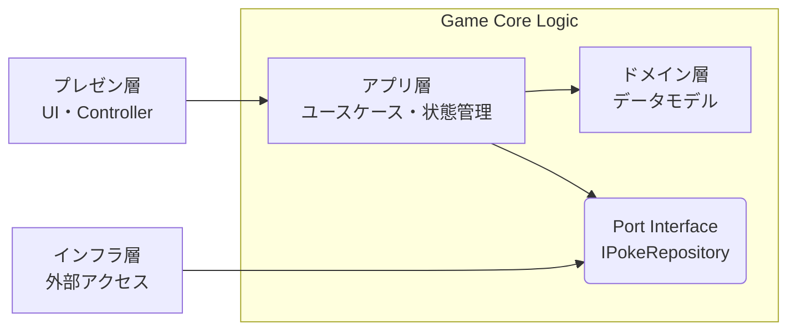

# アーキテクチャ概要

## コンセプト: 4 層構造 かつドメイン中心の Clean Architecture

PokeAPI への依存を UI・ゲームロジックから完全に分離し、変更に強くテストしやすい構成にする。

1. **Domain Layer（ドメイン層）** : 外部に依存しないポケモンデータモデル
2. **Application Layer（アプリ層）** : ユースケース・動的ゲーム状態管理・Port 定義
3. **Infrastructure Layer（インフラ層）** : 外部 API アクセス（PokeAPI）
4. **Presentation Layer（プレゼン層）** : UI・Controller



**ディレクトリ構造**

```
skeleton-app/src/lib/
├── domain/          # ドメイン層
├── application/     # アプリ層
├── infrastructure/  # インフラ層
└── presentation/    # プレゼン層
```

---

## レイヤー構成

### Domain Layer

**責任**:

- PokeAPI から取得したポケモンデータの概念モデルを定義する
- 外部に依存しない静的データモデルと変換ロジック

**ディレクトリ構造**

```
src/lib/domain/
└── models/
    └── PokeData/  # ポケモンデータ
```

**重要**:

- 何にも依存しない（Pure TypeScript）
- ここには Svelte や DOM のコードを一切書かない
- ロジック単体でのテストが可能

**主要コンポーネント**:

- **PokeData**: アプリ内部のポケモン統合モデル
  - PokeAPI の複数エンドポイント（`/pokemon`, `/pokemon-species`）を統合した表現
  - タイプ・ステータス・世代などのデータを統合管理する
  - PokeAPI レスポンス型（外部）とは明確に区別する

### Application Layer

**責任**:

- ユーザーの操作をユースケースとして実装する
- Port Interface を定義し、インフラ層への依存を抽象化する
- Svelte Runes ストアでアプリ状態を管理する

**ディレクトリ構造**

```
src/lib/application/
├── ports/
│   └── IPokeRepository.ts  # Port Interface（PokeAPI 取得の抽象）
├── usecases/               # ゲームロジック
│   ├── janken.ts           # じゃんけん（タイプ相性ベース）勝敗判定
│   ├── dareda.ts           # だれだ（シルエット当て）出題・正解判定
│   ├── kurabe.ts           # くらべ（ステータス比較）判定
│   └── shiritori.ts        # しりとり ルール検証
└── stores/
    └── generationStore.ts  # 世代フィルタ（アプリ全体の SSOT）
```

**主要コンポーネント**:

- **IPokeRepository**: PokeAPI 取得の Port Interface（Port/Adapter Pattern）
  - `getPokemon(idOrName)` / `getType(idOrName)` を定義
  - アプリ層は具象 API クライアントに依存しない

- **usecases**: ゲームロジックを純粋関数として実装
  - ドメインモデル（TypeData 等）を参照するが、UI には依存しない
  - テスト時に UI なしで検証できる構造を維持する

- **generationStore**: 世代フィルタの SSOT
  - 第 1〜9 世代 + 全世代をサポート
  - ローカルストレージで選択を永続化
  - 各ゲームページが subscribe してポケモン範囲を絞り込む

### Infrastructure Layer

**責任**:

- PokeAPI との通信を担う
- Port Interface を実装し、アプリ層を API の実装詳細から隔離する

**ディレクトリ構造**

```
src/lib/infrastructure/
└── adapters/
    └── PokeApiAdapter.ts  # IPokeRepository の具象実装
```

**主要コンポーネント**:

- **PokeApiAdapter**: Port/Adapter Pattern の Adapter
  - `IPokeRepository` を実装
  - PokeAPI を呼び出し、Zod でレスポンスを検証する
  - ドメインモデルへの変換（`convertToPokeData()` 等）を担う
  - テスト時はモック実装に差し替え可能

**依存性逆転（Port/Adapter Pattern）**:

- アプリ層は抽象 Port（`IPokeRepository`）に依存
- インフラ層が具象 Adapter（`PokeApiAdapter`）を提供
- → アプリ層は PokeAPI の実装詳細から完全に分離

### Presentation Layer

**責任**:

- Store の状態を画面に描画する
- ユーザー入力を受け取り、ユースケースを呼び出す
- UI 状態管理（テーマ、音声等）

**ディレクトリ構造**

```
src/lib/presentation/
├── components/   # UI コンポーネント
│   ├── cards/    # PokeCard, PokeChip, PokeTile 等
│   ├── buttons/  # 汎用ボタン類
│   └── modals/   # モーダルダイアログ
├── stores/       # UI 状態管理（themeStore, audioStore）
├── sounds/       # 音声処理
├── utils/        # ナビゲーション・トースト等
└── constants/    # UI 定数値
```

**ロジックの責務**:

- ✅ 表示ロジック（アニメーション、モーダル制御等）
- ❌ ゲームロジック（タイプ相性計算等）→ Application 層に委譲

---

## データフロー（Unidirectional）

```
1. User Action
   ユーザーがゲームを操作（ポケモン選択等）

2. Dispatch
   UI が usecase または store のメソッドを呼ぶ

3. Fetch & Convert
   IPokeRepository.getPokemon(id) → PokeApiAdapter → PokeAPI
   Zod でレスポンス検証 → PokeData（ドメインモデル）へ変換

4. State Update
   Store が新しい状態で上書き

5. Re-render
   Svelte が変更を検知し、画面を再描画
```

---

## 関連ドキュメント

- [ドメイン知識](../domain/overview.md) - ポケモンデータのドメインモデル
- [テスト戦略](./testing-strategy.md) - テストの方針と実装方法
